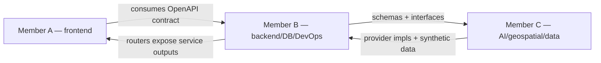
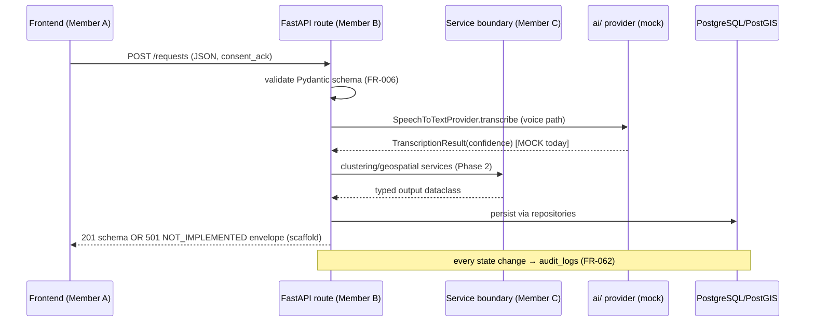

# CivicPulse — Architecture

Status: **scaffold** · PRD §3, §9, §11, §12, §18 are the source of truth.
Related: [`docs/architecture/ARCHITECTURE.md`](docs/architecture/ARCHITECTURE.md) (same content, repo home) ·
[`docs/architecture/SYSTEM_FLOW.md`](docs/architecture/SYSTEM_FLOW.md) · [ADRs](docs/architecture/ADR).

## 1. Modular monolith (why)

The MVP is built by 3 people in a hackathon timeframe. Microservices would multiply
deployment, contract and debugging overhead for zero benefit at demo scale
(PRD §9.3, §12 — explicitly rejected). The FastAPI app is a **modular monolith**:
one process, strict internal module boundaries (`api → services → repositories → db`),
so a future split would be an extraction, not a rewrite.

## 2. System architecture diagram

```mermaid
flowchart TB
    subgraph Client
        C[Citizen browser] --> FE
        P[Planner browser] --> FE
    end
    subgraph Frontend["frontend/ — Next.js + Tailwind :3000"]
        FE[App Router shell<br/>S-01…S-15 placeholder pages]
        CLIENT[lib/api client<br/>NEXT_PUBLIC_API_BASE_URL]
        FE --> CLIENT
    end
    subgraph Backend["backend/ — FastAPI modular monolith :8000"]
        API[api/routes — 18 PRD endpoints<br/>501 placeholders + real schemas]
        SVC[services/ — clustering · geospatial · gap_detection ·<br/>prioritisation · evidence · simulation (empty boundaries)]
        REPO[repositories/]
        API --> SVC --> REPO
    end
    subgraph Data
        DB[(PostgreSQL + PostGIS :5432<br/>18 PRD entities)]
    end
    subgraph AI["ai/ — provider abstraction (Member C)"]
        IF[interfaces: STT · langdetect · normalizer · classifier ·<br/>entity-extractor · embeddings · geocoder]
        MOCK[mock providers — default, no keys]
        REAL[future real providers]
        IF --> MOCK
        IF -.-> REAL
    end
    CLIENT -->|HTTP/JSON| API
    REPO --> DB
    SVC --> IF
```

**Boundaries**

- Frontend ↔ Backend: HTTP/JSON only, contract = generated OpenAPI (`docs/api/openapi/openapi.json`). No shared code.
- Backend ↔ DB: SQLAlchemy 2 models (`backend/app/models`), Alembic migrations, PostGIS geometry on `locations`.
- Backend ↔ AI: only through `ai/` interfaces; provider chosen by env (`AI_STT_PROVIDER=mock`, …). Default mocks need no keys (PRD §11 fallback discipline).
- Deterministic services: empty input/output-typed boundaries under `backend/app/services/*`; Member C fills algorithms without touching routing (PRD §17.4).

## 3. Development dependency diagram (who depends on whom)



- **A depends on** the frozen API contract only — never on backend internals.
- **C depends on** backend schemas (`backend/app/schemas`) and `ai/` interfaces — implements providers/services behind them.
- **B depends on** C's provider selection contract (env vars) and exposes A's endpoints.
- Contract change rule: contract PR first, implementations follow (PRD §18.2, R-07).

## 4. Request processing boundary diagram



Scaffold rule: routes validate against real schemas, then return
`501 {"error":{"code":"NOT_IMPLEMENTED", …}}` — never fake success.

## 5. Ownership boundaries

| Directory | Owner | Others may |
|---|---|---|
| `frontend/` | Member A | read OpenAPI, propose contract PRs |
| `backend/` | Member B | C touches `services/*` placeholders + `schemas/` via contract PRs |
| `ai/`, `data/` | Member C | B wires providers via registry/env, A never imports `ai/` |
| `deploy/`, CI | Member B | propose PRs |
| `docs/api/*`, `docs/architecture/ADR` | shared — contract PR + 1 reviewer |

## 6. Data flow (target, PRD §7 journeys)

intake (FR-001–009) → language/STT (FR-010–011) → NLP extraction (FR-012–018) →
clustering (FR-019–025) → geospatial resolution (FR-026–033) → dataset matching
(FR-030–039) → gap detection (FR-040–044) → priority/equity (FR-045–050) →
evidence panel (FR-051–052) → human review (FR-058–063) → simulation (FR-053–056) →
synthetic outcome (FR-064–067). **None of these steps is implemented yet.**

## 7. Local development & deployment direction

- Local: Docker Compose (`deploy/`) or hybrid (db in Docker, apps local) — `docs/development/SETUP.md`.
- Demo deployment direction (PRD §12): static frontend host + single backend container + managed Postgres. Not built.
- BRICS extensibility is *designed for*, not claimed: language adapters, generic admin hierarchy, dataset versioning (PRD §20).

## 8. Security baseline (scaffold)

CORS via config · secrets only via env · validation-ready Pydantic schemas ·
upload/audit/RBAC boundary placeholders (`core/security.py`, `audit_logs` model).
**No production security or legal compliance is claimed.**
