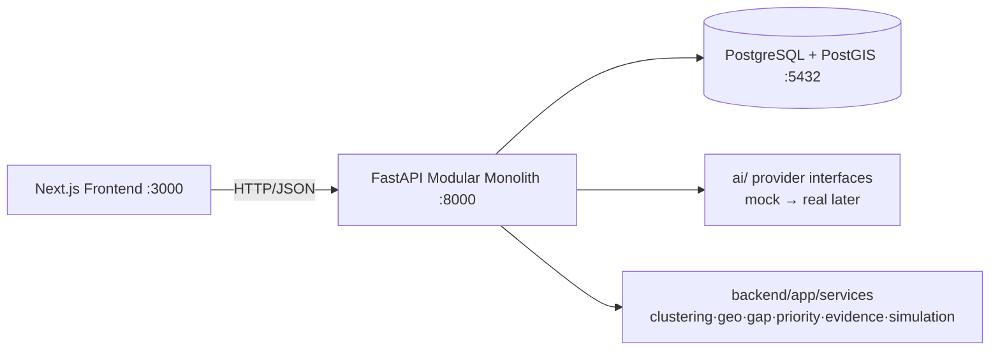

# CivicPulse — AI Development-Needs Intelligence Layer

> **Code for Communities 2.0 · Track 1 — AI for Digital Public Infrastructure & Governance · BRICS Theme: Innovation**

## ⚠️ CURRENT STATUS

**SCAFFOLD ONLY — PRODUCT FEATURES ARE NOT YET IMPLEMENTED.**

This repository is an *empty but runnable* development foundation for a 3-member team.
All AI intelligence, clustering, geocoding, gap-analysis, equity, review and simulation
logic are **placeholders** behind stable contracts. See [What is / is not implemented](#what-is-implemented).

---

## What is CivicPulse?

An explainable AI layer that turns fragmented, multilingual citizen development requests
into evidence-backed, location-aware **development-needs clusters** that human planners can
review, compare against infrastructure and equity data, and simulate policy responses for —
without ever making the final decision itself. Full specification: [`docs/prd/PRD.md`](docs/prd/PRD.md) (SSOT).

## Purpose of this repository

Provide the **Phase 1 foundation** from which all 3 members can start development in
parallel immediately: architecture, contracts, DB schema, environments, CI, docs, and
clear ownership boundaries (PRD §17.3).

## Tech stack

| Layer | Choice |
|---|---|
| Frontend | Next.js (App Router) + TypeScript + Tailwind CSS |
| Backend | Python 3.9+ · FastAPI · SQLAlchemy 2 · Alembic (modular monolith) |
| Database | PostgreSQL 16 + PostGIS |
| AI layer | Provider-agnostic interfaces + local **mock** providers (no API keys needed) |
| Mapping (planned) | Leaflet + OpenStreetMap |
| Infra | Docker Compose · GitHub Actions CI · Makefile |

## Architecture (summary)



Details: [`ARCHITECTURE.md`](ARCHITECTURE.md) · [`docs/architecture/SYSTEM_FLOW.md`](docs/architecture/SYSTEM_FLOW.md) · ADRs in [`docs/architecture/ADR/`](docs/architecture/ADR).

## Repository structure

```
frontend/    Next.js app — S-01…S-15 screen shells, API client     (Member A)
backend/     FastAPI app — routers, models, migrations, services   (Member B)
ai/          AI provider interfaces + mock/placeholder providers   (Member C)
data/        synthetic datasets (labelled), schemas, scripts       (Member C)
docs/        architecture, ADRs, API contract, guides, PRD
tests/       cross-layer contract / integration / smoke tests
deploy/      Dockerfiles + docker-compose (dev + dev overlay)
.github/     CI workflow, PR template
```

## Quick start

**Prerequisites:** Docker (full-stack workflow) **or** Python 3.9+ & Node 20+ (hybrid).

### Option A — full Docker (one command)

```bash
cp .env.example .env
make dev          # db + backend + frontend, hot-reload
```

### Option B — hybrid (db in Docker, apps local)

```bash
cp .env.example .env
make setup        # backend venv + frontend npm install
make db-up        # PostgreSQL+PostGIS on :5432
make db-migrate   # Alembic migrations
make db-seed      # minimal SYNTHETIC seed data
make backend      # http://localhost:8000  (Swagger /docs)
make frontend     # http://localhost:3000
```

Full guide: [`docs/development/SETUP.md`](docs/development/SETUP.md).

### Ports (fixed everywhere)

| Service | URL |
|---|---|
| Frontend | http://localhost:3000 |
| Backend API | http://localhost:8000 |
| Swagger / OpenAPI | http://localhost:8000/docs · `/redoc` · `/openapi.json` |
| PostgreSQL | localhost:5432 |

## Tests / lint / contracts

```bash
make test             # backend + ai + contract + frontend suites
make lint             # ruff, eslint, prettier
make smoke            # live-stack smoke (stack running)
make openapi-export   # regenerate docs/api/openapi/openapi.json
make validate-data    # validate data/synthetic against data/schemas
```

## Database migrations

```bash
make db-up db-migrate     # apply
make db-reset             # drop volumes + re-migrate + re-seed (destructive)
```

## How the three members work in parallel

| Member | Owns | Ownership guide |
|---|---|---|
| **A — Frontend & UX** | `frontend/` | [`docs/team/MEMBER_A.md`](docs/team/MEMBER_A.md) |
| **B — Backend, DB & DevOps** | `backend/`, `deploy/` | [`docs/team/MEMBER_B.md`](docs/team/MEMBER_B.md) |
| **C — AI/ML, Geospatial & Data** | `ai/`, `data/` | [`docs/team/MEMBER_C.md`](docs/team/MEMBER_C.md) |

Shared contracts (change together, announce before merging):
**OpenAPI spec** (`docs/api/openapi/openapi.json`, regenerated from FastAPI) and
**[`docs/api/API_CONTRACT.md`](docs/api/API_CONTRACT.md)**. Branching & PR rules:
[`docs/development/WORKFLOW.md`](docs/development/WORKFLOW.md).

## What is implemented

- ✅ Running frontend shell with all 15 PRD screen placeholders (S-01…S-15)
- ✅ Running FastAPI app: `/health`, `/`, `/version`, CORS, structured logging, OpenAPI
- ✅ All 18 PRD endpoints exposed as **501 Not Implemented** placeholders with real request/response schemas
- ✅ SQLAlchemy model skeletons for all 18 PRD entities + PostGIS geometry
- ✅ Alembic initial migration; PostGIS extension setup
- ✅ AI provider interfaces + deterministic mock providers (no keys required)
- ✅ Deterministic service boundaries (clustering, geospatial, gap, priority, evidence, simulation) — empty
- ✅ Synthetic-data directory + schemas + runnable validation script (all labelled `SYNTHETIC`)
- ✅ Docker Compose (dev + hot-reload overlay), CI, Makefile, docs, team guides, PR template

## What is NOT implemented

❌ Multilingual AI logic · STT pipeline · embeddings/clustering · geocoding ·
infrastructure-gap detection · priority/equity scoring · policy simulator ·
outcome analytics · government API integrations · messaging-app intake ·
production authentication · production deployment.
Every business endpoint returns **501** with a `NOT_IMPLEMENTED` error envelope.

## Where to find things

- **PRD (SSOT):** `docs/prd/PRD.md` — requirements FR-001…FR-073, screens S-01…S-15, journeys 1–10
- **API contract:** `docs/api/API_CONTRACT.md` + generated `docs/api/openapi/openapi.json`
- **Screen inventory → routes:** `frontend/app/**` (each page tags its S-ID)
- **Team guides:** `docs/team/MEMBER_{A,B,C}.md`

## Important data disclaimer

All datasets under `data/synthetic/` are **SYNTHETIC**: not official government data, not
real citizen data, not validated public statistics. Every dataset row and UI surface must
stay visibly labelled `SYNTHETIC` (PRD FR-038, FR-057). No real citizen PII is ever used.
