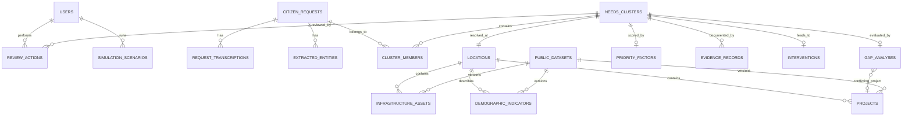

# CivicPulse — AI Development-Needs Intelligence Layer
## Product Requirements Document (PRD)
### Code for Communities 2.0 · Track 1 — AI for Digital Public Infrastructure & Governance · BRICS Theme: Innovation

> **Status: Proposed product specification.** Nothing described here is an already-implemented, tested, or validated system unless explicitly marked "implemented" in a later revision. This PRD is the single source of truth (SSOT) for a **3-member undergraduate AI & Data Science team**, delivered in **3 build phases**.

---

## Table of Contents

1. [Document Control](#1-document-control)
2. [Executive Summary](#2-executive-summary)
3. [Problem Analysis and Research Foundation](#3-problem-analysis-and-research-foundation)
4. [Product Vision, Goals and Non-Goals](#4-product-vision-goals-and-non-goals)
5. [User Personas and Stakeholders](#5-user-personas-and-stakeholders)
6. [Functional Requirements](#6-functional-requirements)
7. [End-to-End User Journeys](#7-end-to-end-user-journeys)
8. [UI/UX and Information Architecture](#8-uiux-and-information-architecture)
9. [Data Architecture and Database Design](#9-data-architecture-and-database-design)
10. [Backend and API Requirements](#10-backend-and-api-requirements)
11. [AI/ML Architecture](#11-aiml-architecture)
12. [Technology Stack and Infrastructure](#12-technology-stack-and-infrastructure)
13. [Security, Privacy and Digital Public Good Principles](#13-security-privacy-and-digital-public-good-principles)
14. [Acceptance Criteria](#14-functional-and-non-functional-acceptance-criteria)
15. [Evaluation and Demonstration Strategy](#15-evaluation-and-demonstration-strategy)
16. [MVP Scope and Feature Prioritisation](#16-mvp-scope-and-feature-prioritisation)
17. [Development Roadmap — 3-Member Team, 3 Phases](#17-development-roadmap--3-member-team-3-phases)
18. [Repository and Development Workflow](#18-repository-and-development-workflow)
19. [Risk Register and Technical Unknowns](#19-risk-register-and-technical-unknowns)
20. [Future Roadmap and BRICS Scalability](#20-future-roadmap-and-brics-scalability)
21. [Final Product Definition and Readiness Checklist](#21-final-product-definition-and-readiness-checklist)
Glossary

---

## 1. Document Control

| Field | Value |
|---|---|
| Product name (working) | **CivicPulse** — AI Development-Needs Intelligence Layer |
| Document version | v1.0 (adapted for 3-member team / 3-phase roadmap) |
| Date | 27 September 2026 |
| Purpose | SSOT for design, engineering, AI, data and demo work for the hackathon prototype |
| Scope | India-focused hackathon prototype, architected to be BRICS-extensible |
| Intended readers | Product/UX designer, frontend dev, backend dev, AI/ML dev, data engineer — collapsed here into **3 people who will each wear 2–3 of these hats** |
| Source documents | (1) *AI for Digital Public Infrastructure & Governance* — Research Report, 27 Sep 2026 ("**Report A**"); (2) *Code for Communities 2.0, Track 1* — Research Draft, 26 Sep 2026 ("**Report B**"); (3) Official challenge page, hack2skill.com/event/codeforcommunities2 |
| Team size assumption | **3 undergraduate AI & Data Science engineers** (this PRD supersedes any 4-person plan) |
| Roadmap assumption | **3 build phases** (this PRD supersedes any 6-phase plan) |

**Team-size note:** The source master-prompt template assumes 4 members and 6 phases. This PRD deliberately consolidates that into 3 members and 3 phases (Section 17), which means the MVP scope (Section 16) is trimmed harder than a 4-person plan would allow. Where the two research reports imply a feature list larger than 3 people can realistically ship, this PRD explicitly marks the excess as **P1/P2** rather than silently keeping it as P0.

**Assumptions / unresolved decisions carried forward from research:**
- No confirmed API access to CPGRAMS, MyGov, Meri Sadak, eGramSwaraj/Gram Manchitra, UMANG, or data.gov.in exists. All integrations are **read-style, offline, curated-dataset simulations** unless proven otherwise before the hackathon.
- No confirmed LLM/speech API budget exists yet — Section 11 lists free-tier-compatible fallbacks.
- Final team member skill mapping (who does frontend vs. AI vs. backend) is not yet locked; Section 17 proposes a default split that assumes reasonably even skills across the 3 members.

---

## 2. Executive Summary

**One-sentence definition:** CivicPulse is an explainable AI layer that turns fragmented, multilingual citizen development requests into evidence-backed, location-aware "development-needs clusters" that human planners can review, compare against infrastructure and equity data, and simulate policy responses for — without ever making the final decision itself.

**The problem:** Indian citizens already have several channels to report needs and grievances (MyGov, CPGRAMS, Meri Sadak, eGramSwaraj/Gram Manchitra, data.gov.in). What none of them do well is the *analytical* step after collection: deduplicating overlapping reports, resolving messy locations, checking against actual infrastructure and demographic context, correcting for participation bias, and presenting a transparent, inspectable case for or against a development priority.

**Why existing systems don't solve this:** Per both research reports, each existing system is strong at *collection* or *sector-specific* feedback (roads, grievances, Panchayat works) but none of them combine multilingual citizen signal + deduplication + infrastructure/demographic context + equity adjustment + explainable evidence + simulate-before-you-decide tooling, in one interoperable layer. Report B frames this directly: *"the strongest research gap is not another place to submit a complaint... it is what happens after."*

**What we are building:** A modular monolith web application with:
- A citizen-facing intake surface (text + voice, ≥2 Indian languages).
- An AI pipeline that structures, deduplicates, and geolocates requests into **development-needs clusters** (the core analytical unit — never an individual complaint).
- A planner-facing dashboard with a demand map, evidence panel, equity-aware prioritisation view, a policy what-if simulator, a human review/approval workflow, and a synthetic outcome-measurement demo.

**Who will use it:** Citizens (submit requests), government planning officers/analysts (review, approve, simulate), and — for the hackathon — judges evaluating the demonstration.

**What makes it different:** The four differentiators named in Report A: **cross-channel demand clustering, equity-aware prioritisation, a policy what-if simulator, and outcome measurement** — all wrapped in a mandatory human-in-the-loop review gate and a fully inspectable evidence panel.

**What the hackathon prototype will demonstrate:** End-to-end flow from a Marathi voice complaint → transcription → clustering → geospatial + infrastructure matching → gap flag with evidence → equity comparison → planner approval → policy simulation → synthetic before/after outcome.

**What remains outside the prototype:** Real government API integration, nationwide datasets, production-grade security/compliance, cross-BRICS localisation, forecasting and implementation-risk modules (see Section 4).

---

## 3. Problem Analysis and Research Foundation

### 3.1 The fragmentation problem, in full
Both reports converge on the same structural diagnosis:
- **Channel fragmentation** — a citizen may call, message, use a portal, or send a voice note; none of these are unified.
- **Wording fragmentation** — "no bus", "transport problem", "bus not available" are the same need in different words, and worse, may appear in Hindi, Marathi, or code-mixed forms.
- **Location fragmentation** — a village name, a landmark, a pincode, a road name, or GPS coordinates might each describe the same place with wildly different structure and confidence.
- **Governance-level fragmentation** — the same issue can touch a municipal body, a district department, a state department, or a central scheme simultaneously.

### 3.2 Duplicate vs. distinct need
Report B's example: 150 people from several villages reporting difficulty reaching a health centre is not "150 problems" nor automatically "1 problem" — it requires clustering by semantic similarity + geography + time before the number means anything. This is why **the cluster, not the complaint, is CivicPulse's core analytical unit.**

### 3.3 Multilingual and code-mixed input
Naive translation-then-analyse pipelines lose place names, slang, and locally meaningful context (Report A, §6.1; Report B, §4C). CivicPulse must **preserve the original-language text and extracted entities alongside** any normalised/translated representation.

### 3.4 Demand ≠ priority
Report A is explicit: *"Complaint volume should not be the sole representation of need."* Digital participation is uneven — areas with more smartphones, literacy, or organised reporting will out-report areas with a genuinely larger gap (Report B, §4F). This is the core justification for the **equity-adjustment factor** in Section 6.7.

### 3.5 Cross-department causality
A "transport" complaint might really be a school-siting issue, a road issue, or a service-frequency issue (Report B, §4E). CivicPulse extracts issue category as a *citizen-stated* field but does not treat it as ground truth for root cause — gap detection (Section 6.6) cross-checks against multiple infrastructure layers, not just the citizen's chosen category.

### 3.6 Data interoperability
Public datasets differ in boundary definitions, codes, and update cycles (Report B, §4G). The hackathon prototype sidesteps this by using a **small, curated, versioned dataset** (Section 6.5) rather than attempting live multi-source reconciliation.

### 3.7 Explainability as a hard requirement
Both reports state that every flag must be traceable to evidence a human can inspect (Report A §6.5, §8; Report B §4H, §6). CivicPulse therefore treats the Evidence & Explainability Engine (Section 6.8) as a P0 requirement, not a "nice to have" dashboard feature.

### 3.8 Existing systems reviewed

| System | Documented role (per reports) | How CivicPulse complements it | Integration assumption needing verification |
|---|---|---|---|
| **MyGov** | Citizen engagement — ideas, polls, public participation | Turns development-related *signals* into structured, location-aware demand intelligence, rather than open discussion | No API access confirmed; treated as a conceptual "upstream channel" only |
| **CPGRAMS** | Centralised grievance redress; current portal reportedly supports voice-based grievance filing in 22 scheduled languages | Aggregates development-type signals across sources and adds planning context CPGRAMS does not provide | No API/data-sharing access confirmed |
| **Meri Sadak** | Road-specific citizen feedback (PMGSY), including photos | Extends the same clustering/evidence approach across sectors beyond roads | Domain-specific; not assumed reusable for other sectors |
| **eGramSwaraj / Gram Manchitra** | Panchayat planning, works, assets, financial and geospatial data | Feeds citizen demand *into* this existing planning context rather than duplicating it | Assumed read-only reference data; no live integration in MVP |
| **data.gov.in** | Open datasets/APIs across sectors | Supplies the demographic/infrastructure layer CivicPulse matches demand against | Dataset availability, format and freshness for any specific district must be verified before the hackathon; **synthetic fallback is the default plan** (Section 6.5) |
| **UMANG** | Unified mobile app for government services | Not directly integrated; noted for completeness per Report B's source list | Out of scope |

**Rule applied throughout this PRD:** No claim of live government API access, credentials, or verified real-time datasets is made anywhere below unless explicitly flagged "confirmed." Default assumption is **curated/synthetic data** (see Section 6.5).

---

## 4. Product Vision, Goals and Non-Goals

**Vision:** A Digital Public Good that lets any government planner, in any BRICS country, see an evidence-backed, equity-aware picture of unmet development need — built from citizens' own words, in their own languages.

**Mission (hackathon-scoped):** Prove, end-to-end, that multilingual citizen signals can be turned into deduplicated, geolocated, infrastructure-checked, explainable development-needs clusters that a human can act on.

**Primary value proposition:** *"We don't collect more complaints — we make the complaints governments already have finally usable."*

### 4.1 Three scope tiers

| Tier | Definition | Examples |
|---|---|---|
| **A. Hackathon MVP** | Must be implemented and demoed live, by 3 people, in the hackathon timeframe | Text+voice intake (2 languages), clustering, geospatial resolution with confidence, curated dataset matching, evidence panel, basic equity comparison, basic policy simulator, human review actions, synthetic outcome demo |
| **B. Extended prototype** | Implement only if Phase 3 finishes early | Messaging-app (e.g. WhatsApp/Telegram bot) intake, richer equity sensitivity controls, additional language, richer dataset (more sectors) |
| **C. Long-term BRICS Digital Public Good** | Requires institutional partnerships, real data-sharing agreements, production infra, country adapters | Live CPGRAMS/data.gov.in integration, forecasting (30–90 day demand), implementation-risk modelling, multi-country deployment, community data governance |

### 4.2 Non-goals (explicit)
CivicPulse is **not**:
- A generic complaint portal, FAQ chatbot, or complaint-count dashboard.
- A replacement for CPGRAMS, MyGov, Meri Sadak, eGramSwaraj, or data.gov.in.
- An autonomous budget allocator or policy decision-maker — **every consequential action requires human approval** (Section 6.10).
- A trained/fine-tuned custom LLM — the team uses existing APIs/models, not model training from scratch.
- A system that claims completed government integrations, verified performance numbers, or legal compliance it hasn't earned.

---

## 5. User Personas and Stakeholders

| Persona | Role/context | Goals | Pain points | Access level | Key workflows |
|---|---|---|---|---|---|
| **Citizen (Priya)** | Rural/semi-urban resident, may have low digital literacy, prefers voice in local language | Report an unmet need quickly, in her own language | Doesn't know who to report to; existing forms are English/text-heavy | Public, no login (or lightweight phone-based ID) | Submit request (voice/text) → see confirmation |
| **Planning Officer (Arjun)** | District/state-level analyst | Understand where real gaps are, without wading through raw complaints | Data is scattered; no single evidence view; unsure which complaints are duplicates | Authenticated, role: `analyst` | Review dashboard, open cluster, inspect evidence, run simulator |
| **Local Admin Reviewer (Fatima)** | Municipal/Panchayat-level reviewer | Validate/correct AI-flagged clusters before escalation | AI may mislocate or miscluster; needs to correct, not just approve/reject | Authenticated, role: `reviewer` | Approve / reject / request-more-evidence / correct location or category |
| **Departmental Decision-Maker (Rahul)** | Sector head (e.g. Transport dept.) | Decide (outside the system) where funds should go, informed by evidence | Wants trade-off visibility, not a black-box score | Authenticated, role: `decision_maker` (read + simulate, no destructive actions) | View equity/priority breakdown, run "what-if" scenarios |
| **System Admin / Data Steward (Dev)** | Technical steward, one of the 3 team members in the live demo | Keep datasets fresh, manage users, audit actions | N/A for hackathon (single steward) | Authenticated, role: `admin` | Manage dataset versions, view audit log |
| **Hackathon Evaluator** | Judge | Assess whether the system does what it claims, live | Wants to see real evidence, not a scripted fake | Demo login | Walk through the full E2E journey (Section 7) |

**Permission boundary (explicit):** Citizens **never** see other citizens' raw submissions, cluster-level evidence, or planning data — they only see their own submission's confirmation/status. All analytical views are behind the `analyst`/`reviewer`/`decision_maker`/`admin` roles.

---

## 6. Functional Requirements

Priorities: **P0** = mandatory for hackathon MVP · **P1** = if time/capacity permits · **P2** = future/production.

### 6.1 Citizen Request Intake

| ID | Feature | Actor | Trigger | Behaviour | Priority | Acceptance Criteria |
|---|---|---|---|---|---|---|
| FR-001 | Text request submission | Citizen | Opens intake form | Free-text field + optional structured location + category picker | P0 | Submission stored with timestamp, channel=`text`, raw text preserved verbatim |
| FR-002 | Voice request submission | Citizen | Records/upload audio | Audio captured (≤60s), sent for transcription | P0 | Audio + transcript + detected language all stored; failure shows retry option |
| FR-003 | ≥2 Indian language support | System | Any submission | Language auto-detected among {Hindi, Marathi, English} (MVP set) | P0 | Correct language tag stored for ≥90% of curated test set |
| FR-004 | Original text/audio preservation | System | Any submission | Never overwrite original with a translated/normalised version | P0 | Original field is immutable once written |
| FR-005 | Consent notice | Citizen | Before first submission | Plain-language consent shown, must be acknowledged | P0 | No submission stored without `consent_ack=true` |
| FR-006 | Submission validation | System | On submit | Rejects empty text, unsupported language, >60s audio | P0 | Clear inline error; no partial record created |
| FR-007 | Unclear-audio handling | System | STT confidence < threshold | Flags request as `needs_manual_review`, still stored | P0 | Flagged requests appear in a review queue, not silently dropped |
| FR-008 | Missing-location handling | Citizen/System | Location field empty | Prompt for optional free-text location; if still empty, mark `location_unresolved` | P0 | Never auto-fabricates coordinates (see FR-021) |
| FR-009 | Messaging-app intake | Citizen | N/A (stretch) | WhatsApp/Telegram bot forwards messages into the same intake pipeline | P1 | Clearly labelled "simulated/manually imported" in the demo if not truly wired up |

### 6.2 Multilingual AI Processing

| ID | Feature | Priority | Notes |
|---|---|---|---|
| FR-010 | Language detection | P0 | Deterministic library first (e.g. `langid`/`fastText`) before any LLM call |
| FR-011 | Speech-to-text | P0 | See Section 11 for model options |
| FR-012 | Semantic normalisation | P0 | LLM-assisted; original text always retained (FR-004) |
| FR-013 | Code-mixed handling | P1 | Best-effort; flagged low-confidence if mixed-language ratio is high |
| FR-014 | Issue classification | P0 | Fixed taxonomy (transport, water, health, education, roads, other) + confidence score |
| FR-015 | Entity extraction | P0 | Place names, facility names, time expressions, urgency keywords |
| FR-016 | Local place-name preservation | P0 | Entity extraction must not translate proper nouns |
| FR-017 | Confidence scores on all extracted fields | P0 | Displayed in evidence panel; used for review-queue routing |
| FR-018 | Human correction workflow | P0 | Reviewer can overwrite classification/entities; original AI output retained for audit |

### 6.3 Cross-Channel Deduplication and Demand Clustering

| ID | Feature | Priority | Notes |
|---|---|---|---|
| FR-019 | Embedding-based similarity | P0 | Sentence-embedding cosine similarity on normalised text |
| FR-020 | Geo+time-windowed clustering | P0 | Combine semantic similarity + geographic proximity (radius) + time window (e.g. 30 days) |
| FR-021 | No fabricated coordinates | P0 | Unresolved-location requests are excluded from spatial clustering but retained in a "needs location" queue |
| FR-022 | Cluster lifecycle states | P0 | `forming → active → under_review → approved/rejected → archived` |
| FR-023 | One-to-many/many-to-one mapping | P0 | A cluster tracks N member-requests; a request belongs to exactly 1 active cluster |
| FR-024 | Duplicate-inflation prevention | P0 | Cluster's "independent demand count" = deduplicated count, always shown alongside raw message count |
| FR-025 | Human review for uncertain cluster assignment | P0 | Similarity between two clustering thresholds → routed to reviewer, not auto-merged |

### 6.4 Geospatial Intelligence

| ID | Feature | Priority | Notes |
|---|---|---|---|
| FR-026 | Location extraction + geocoding | P0 | Village/ward/landmark/road/pincode → lat/long via curated gazetteer + OSM Nominatim fallback |
| FR-027 | Geographic hierarchy | P0 | State → District → Block/Taluka → Village/Ward |
| FR-028 | Location confidence score | P0 | 0–1 score; below threshold → `location_unresolved` |
| FR-029 | Map-based visualisation | P0 | Leaflet map with cluster markers, sized/coloured by priority |
| FR-030 | Infrastructure proximity | P0 | Nearest facility of relevant type + distance, from curated dataset |
| FR-031 | Affected population estimate | P0 | From curated demographic dataset, at village/ward granularity |
| FR-032 | Spatial aggregation | P0 | Roll-up of clusters to block/district level for the map's zoom-out view |
| FR-033 | Unresolved-location fallback | P0 | Never plot at (0,0) or a guessed centroid; show in a separate "needs geocoding" list instead |

### 6.5 Public Data and Infrastructure Intelligence

Every dataset used must be labelled as one of:
1. **Confirmed source** (named in the research reports),
2. **Candidate public dataset** (needs verification before hackathon day), or
3. **Synthetic/curated** (built by the team for the MVP).

| ID | Feature | Priority | Dataset label |
|---|---|---|---|
| FR-034 | Demographic data ingestion | P0 | Synthetic/curated (candidate: Census/data.gov.in — unverified) |
| FR-035 | Infrastructure asset data (roads, schools, health, water) | P0 | Synthetic/curated (candidate: data.gov.in sector datasets — unverified) |
| FR-036 | Coverage/deprivation indicators | P1 | Derived from FR-034/035, not a separately sourced dataset |
| FR-037 | Sanctioned/ongoing/completed project registry | P0 | Synthetic/curated (candidate: eGramSwaraj/Gram Manchitra — unverified, no access confirmed) |
| FR-038 | Dataset versioning | P0 | Every dataset row tagged with `dataset_version`, `ingested_at` |
| FR-039 | Dataset validation on ingest | P0 | Schema check + range checks; malformed rows quarantined, not silently dropped |

**Fallback plan:** If no verified public dataset is available before the hackathon (default assumption), the team builds a **realistic synthetic dataset** for 1 state / 2–3 districts, clearly labelled `SYNTHETIC` in the UI (see FR-057).

### 6.6 Infrastructure Gap Detection

| ID | Feature | Priority | Notes |
|---|---|---|---|
| FR-040 | Cluster-vs-infrastructure comparison | P0 | Compares cluster's issue type + location against nearest matching facility/service in FR-035 |
| FR-041 | Benchmark/coverage comparison | P0 | Simple, documented benchmark (e.g. "health facility within 5km") — not a claimed national standard |
| FR-042 | Existing-project check | P0 | Before flagging a gap, check FR-037 registry for an overlapping sanctioned/ongoing project |
| FR-043 | Evidence requirement before flagging | P0 | A gap flag requires: deduplicated demand count ≥ threshold AND infrastructure check AND no conflicting active project |
| FR-044 | Distinguish demand / gap / recommendation | P0 | UI always shows these as three separate labelled fields, never merged into one verdict |

### 6.7 Equity-Aware Prioritisation

Illustrative model (from Report A, explicitly **not** an objective/validated formula):

```
Priority Index = Demand × Gap × Impact × Equity Adjustment
```

| ID | Feature | Priority | Notes |
|---|---|---|---|
| FR-045 | Factor definitions surfaced in UI | P0 | Demand = deduplicated report count; Gap = coverage shortfall; Impact = affected population; Equity = deprivation-proxy multiplier |
| FR-046 | Configurable weights | P0 | Sliders/inputs per factor, defaulting to equal weighting |
| FR-047 | Normalisation | P0 | Each factor scaled 0–1 before multiplication |
| FR-048 | Missing-data handling | P0 | Missing factor → excluded from product, flagged "incomplete score," never defaulted to 0 or 1 silently |
| FR-049 | Volume-view vs. equity-view toggle | P0 | Side-by-side or toggle comparison, so participation bias is visible, not hidden |
| FR-050 | Factor-contribution breakdown | P0 | Every cluster's score shown with its 4 factor values, not just the final number |

### 6.8 Evidence and Explainability Engine

| ID | Feature | Priority | Notes |
|---|---|---|---|
| FR-051 | Evidence panel per cluster | P0 | Shows: member requests (deduplicated + raw), time range, location + confidence, population/infra indicators, existing-project check result, dataset versions used, priority factor breakdown, uncertainty flags |
| FR-052 | No unsupported AI claims | P0 | Every displayed number links to either a stored data value or a documented formula — no free-text LLM "summary of why this matters" without a citation to the underlying fields |

### 6.9 Policy What-If Simulator

| ID | Feature | Priority | Notes |
|---|---|---|---|
| FR-053 | Sector budget sliders | P0 | Roads, Water, Health, Education (MVP sector set) |
| FR-054 | Scenario coverage estimate | P0 | Using curated cost-per-intervention assumptions (synthetic if real costs unavailable) |
| FR-055 | Scenario comparison (before/after) | P0 | Simple bar/number comparison of clusters "coverable" under scenario vs. current |
| FR-056 | Limitations disclosure | P0 | Persistent UI note: "Estimates use synthetic/curated cost data — not official budget figures" |
| FR-057 | Synthetic-data labelling | P0 | Any synthetic dataset visibly tagged `SYNTHETIC` wherever shown |

### 6.10 Human Review and Governance

| ID | Feature | Priority | Notes |
|---|---|---|---|
| FR-058 | Open flagged cluster | P0 | Reviewer opens cluster detail + evidence panel |
| FR-059 | Approve / Reject / Request-more-evidence | P0 | Tri-state action, each with a required note field |
| FR-060 | Correct classification/location | P0 | Inline edit, original AI value retained in audit log |
| FR-061 | Review notes + status history | P0 | Timestamped, attributed to reviewer identity |
| FR-062 | Audit logging | P0 | Every state-changing action logged: actor, timestamp, before/after value |
| FR-063 | AI-suggestion vs. human-decision distinction | P0 | UI never shows an AI output as "decided" — always "suggested, pending review" until a human acts |

### 6.11 Outcome Measurement

| ID | Feature | Priority | Notes |
|---|---|---|---|
| FR-064 | Baseline indicator capture | P1 | At cluster-approval time, snapshot relevant indicator (e.g. population served) |
| FR-065 | Synthetic follow-up/outcome demo | P0 | Simulated "3 months later" indicator change, clearly labelled synthetic |
| FR-066 | Before/after comparison view | P0 | Simple paired display, no causal claim |
| FR-067 | Correlation-not-causation disclaimer | P0 | Persistent label: "Observed change, not proven causal impact" |

### 6.12 Administrative Dashboard and Analytics

| ID | Feature | Priority | Notes |
|---|---|---|---|
| FR-068 | National/regional overview | P0 | Cluster count, top sectors, top-priority regions |
| FR-069 | Demand hotspot heatmap | P0 | Leaflet heatmap layer |
| FR-070 | Sector/district filters | P0 | Standard filter bar |
| FR-071 | Cluster list + evidence link | P0 | Table view, sortable by priority score |
| FR-072 | Review queue | P0 | Filtered list of `under_review` clusters |
| FR-073 | Dataset freshness indicator | P1 | Shows `dataset_version`/`ingested_at` per source |

---

## 7. End-to-End User Journeys

### Journey 1 — Marathi voice request
**User action:** Citizen records a Marathi voice message: *"village has a school but no bus after 5 PM."*
**System processing:** FR-002/003 detect Marathi → FR-011 transcribes → FR-014/015 classify (`transport_access`) and extract entities (village name, "school," "5 PM").
**Data involved:** Audio blob, transcript, language tag, entity list.
**Result:** Request stored, `channel=voice`, `status=processed`.
**Error/fallback:** If STT confidence low → FR-007 flags `needs_manual_review`.
**Next step:** Enters clustering pipeline (Journey 3).

### Journey 2 — Same need, different language/channel
**User action:** A citizen from a nearby village submits the same complaint via text, in Hindi.
**System processing:** FR-010 detects Hindi → FR-012 normalises → same `transport_access` category.
**Result:** Second independent request record, not yet linked to Journey 1's request.
**Next step:** Clustering (Journey 3) determines whether these are the same cluster.

### Journey 3 — Clustering into a development-needs cluster
**User action:** None (system-triggered, batch or near-real-time).
**System processing:** FR-019/020 compute embedding similarity + geo/time proximity between Journey 1 and 2's requests (and any others nearby).
**Data involved:** Embeddings, coordinates (or `location_unresolved` flag), timestamps.
**Result:** A new cluster is formed (or an existing one is extended) with `independent_demand_count = 2` (deduplicated).
**Error/fallback:** If similarity is in the uncertain band → FR-025 routes to reviewer instead of auto-merging.
**Next step:** Journey 4 (context matching).

### Journey 4 — Comparing against population/road/transport/project data
**User action:** None (system-triggered).
**System processing:** FR-030/031 attach nearest facility + population estimate; FR-042 checks FR-037 project registry.
**Result:** Cluster enriched with infrastructure context and a "no conflicting project found" result.
**Next step:** Journey 5 (gap flag).

### Journey 5 — Flagging a possible infrastructure gap
**System processing:** FR-040/041/043 evaluate demand + gap + no-conflicting-project conditions.
**Result:** Cluster flagged `possible_gap = transport_access`, with FR-051 evidence panel populated.
**Next step:** Journey 6 (planner review).

### Journey 6 — Planner reviews, corrects, approves/rejects
**User action:** Fatima (reviewer) opens the cluster, inspects evidence, notices the location pin is slightly off, corrects it (FR-060), then approves (FR-059).
**Result:** Cluster status → `approved`; audit log entry created (FR-062).
**Next step:** Journey 7 (simulation).

### Journey 7 — Policy simulator
**User action:** Arjun (analyst) opens the simulator, allocates a hypothetical ₹X to "Transport," and observes how many approved clusters (incl. this one) would be "coverable" (FR-053–056).
**Result:** Scenario comparison rendered; limitations disclaimer shown (FR-056).
**Next step:** Journey 8 (outcome demo).

### Journey 8 — Synthetic outcome measurement
**System processing:** FR-065 generates a synthetic "3 months later" follow-up indicator for the approved cluster (e.g., simulated reduction in complaint recurrence).
**Result:** Before/after view shown with FR-067's causation disclaimer.

### Journey 9 (required) — Low-confidence location scenario
**User action:** A citizen submits *"the road near the old temple is broken"* with no other location detail.
**System processing:** FR-026 geocoding attempt fails to resolve confidently → FR-028 confidence below threshold → FR-033 routes to "needs geocoding" list instead of plotting a guessed point.
**Next step:** A reviewer manually resolves the location (FR-060), after which it re-enters the clustering pipeline.

### Journey 10 (required) — Existing project prevents a duplicate recommendation
**User action:** A cluster is formed for "no bridge access to Village X."
**System processing:** FR-042 checks FR-037 and finds an *ongoing* bridge project already covering that exact area.
**Result:** System does **not** flag a new gap; instead shows "Related project already in progress" in the evidence panel, per FR-044's demand/gap/recommendation separation.

---

## 8. UI/UX and Information Architecture

### 8.1 Screen inventory

| Screen ID | Screen | User | Purpose | Key states |
|---|---|---|---|---|
| S-01 | Citizen Landing / Submit | Citizen | Entry point, choose text or voice | Empty, recording, submitting, success, error |
| S-02 | Voice Review | Citizen | Confirm transcript before final submit | Loading (STT), editable transcript, low-confidence warning |
| S-03 | Submission Confirmation | Citizen | Reference ID + what happens next | Success only |
| S-04 | Admin Login | Analyst/Reviewer/Admin | Role-based demo login | Error (bad credentials) |
| S-05 | Command Dashboard | Analyst | National/regional overview (FR-068) | Loading, populated, empty (no data) |
| S-06 | Demand Intelligence Map | Analyst/Reviewer | Heatmap + cluster markers (FR-069) | Loading, populated, "needs geocoding" toggle |
| S-07 | Cluster Detail | Analyst/Reviewer | Full cluster record | Loading, populated |
| S-08 | Evidence Panel | Analyst/Reviewer | Embedded in S-07; full traceability (FR-051) | Populated, "incomplete score" state |
| S-09 | Infrastructure Gap View | Analyst | Demand vs. coverage vs. existing project | Gap found / no gap / conflicting project found |
| S-10 | Equity Comparison | Analyst/Decision-maker | Volume view vs. equity view toggle | Populated |
| S-11 | Policy Simulator | Decision-maker/Analyst | Budget sliders, scenario compare | Default scenario, custom scenario, disclaimer always visible |
| S-12 | Human Review Queue | Reviewer | List of `under_review` clusters | Empty, populated |
| S-13 | Review & Audit Detail | Reviewer/Admin | Action history for one cluster | Populated |
| S-14 | Outcome Measurement | Analyst | Before/after synthetic demo | Populated (synthetic-labelled) |
| S-15 | Dataset & Settings | Admin | Dataset version list, user roles | Populated |

Each screen must define layout/components, primary/secondary actions, empty/loading/error states, and mobile behaviour at build time (Phase 1 wireframes) — captured in a living design file, not duplicated here to avoid drift.

### 8.2 Design principles
- **Public-sector clarity over decoration:** data-dense where necessary (S-05 to S-11), simple and large-tap-target for citizen screens (S-01 to S-03).
- **Low-end device support:** citizen screens must work on a basic Android browser with throttled 3G.
- **Multilingual UI chrome:** at minimum, S-01–S-03 labels available in the MVP's supported languages, not just the citizen's free text.
- **No opaque scores anywhere:** any number shown (priority index, coverage %, population estimate) must be one tap away from its evidence breakdown.

---

## 9. Data Architecture and Database Design

### 9.1 Entity summary

| Entity | Purpose | Key fields | PK | Key FKs |
|---|---|---|---|---|
| `users` | Login + role | id, name, phone/email, role | id | — |
| `citizen_requests` | Raw submission | id, channel, raw_text, audio_url, language, transcript, consent_ack, created_at | id | — |
| `request_transcriptions` | Audio metadata | id, request_id, stt_model, confidence | id | request_id → citizen_requests |
| `extracted_entities` | NLP output | id, request_id, entity_type, value, confidence | id | request_id → citizen_requests |
| `locations` | Resolved geography | id, admin_hierarchy(state/district/block/village), lat, long, confidence, source_text | id | — |
| `needs_clusters` | Core analytical unit | id, issue_type, status, independent_demand_count, raw_message_count, created_at | id | location_id → locations |
| `cluster_members` | Cluster ↔ request mapping | id, cluster_id, request_id, similarity_score | id | cluster_id, request_id |
| `infrastructure_assets` | Facilities/roads/etc. | id, type, name, location_id, dataset_version | id | location_id |
| `demographic_indicators` | Population/deprivation | id, location_id, population, deprivation_index, dataset_version | id | location_id |
| `public_datasets` | Dataset registry | id, name, source_label(confirmed/candidate/synthetic), version, ingested_at | id | — |
| `projects` | Sanctioned/ongoing/completed | id, name, sector, status, location_id, dataset_version | id | location_id |
| `gap_analyses` | Gap-detection results | id, cluster_id, gap_found(bool), benchmark_used, conflicting_project_id | id | cluster_id, conflicting_project_id → projects |
| `priority_factors` | Score breakdown | id, cluster_id, demand, gap, impact, equity_adj, priority_index | id | cluster_id |
| `evidence_records` | Evidence panel snapshot | id, cluster_id, payload(jsonb), generated_at | id | cluster_id |
| `simulation_scenarios` | Policy simulator runs | id, user_id, sector_allocations(jsonb), created_at | id | user_id |
| `review_actions` | Human review log | id, cluster_id, reviewer_id, action, note, created_at | id | cluster_id, reviewer_id |
| `interventions` | Approved cluster → hypothetical action | id, cluster_id, baseline_snapshot, followup_snapshot, is_synthetic | id | cluster_id |
| `audit_logs` | Full audit trail | id, actor_id, action, before_value, after_value, created_at | id | actor_id |

### 9.2 ER diagram (Mermaid)



### 9.3 Storage notes
- **Relational + geospatial:** PostgreSQL + PostGIS for `locations`, `infrastructure_assets`, `projects` (spatial queries, distance calc).
- **File-based:** raw audio stored as blobs (local disk or object storage), referenced by URL in `request_transcriptions`.
- **Derived, not stored redundantly:** `priority_factors.priority_index` is computed, not hand-entered; `evidence_records.payload` is a denormalised JSON snapshot for fast panel rendering (not the source of truth — always regeneratable from the relational tables).
- **No microservices for MVP** — a single PostgreSQL instance and a modular monolith backend is sufficient for 3 people and hackathon scale.

---

## 10. Backend and API Requirements

**Framework:** Python + FastAPI (per both reports' technology direction), unless the team has a strong reason otherwise.

### 10.1 Key endpoints

| Method | Endpoint | Purpose | Auth |
|---|---|---|---|
| POST | `/auth/login` | Demo login, returns role-scoped token | None → issues token |
| POST | `/requests` | Submit citizen text/voice request (FR-001/002) | None (public) |
| POST | `/requests/{id}/audio` | Upload/attach audio for transcription | None (public) |
| GET | `/requests/{id}` | Citizen checks own submission status | None (token-less reference ID) |
| GET | `/clusters` | List clusters, filterable by sector/district/status | analyst+ |
| GET | `/clusters/{id}` | Full cluster detail + evidence | analyst+ |
| GET | `/clusters/{id}/evidence` | Evidence panel payload (FR-051) | analyst+ |
| POST | `/clusters/{id}/review` | Approve/reject/request-more-evidence (FR-059) | reviewer+ |
| PATCH | `/clusters/{id}` | Correct classification/location (FR-060) | reviewer+ |
| GET | `/geospatial/clusters` | GeoJSON for map rendering (FR-029) | analyst+ |
| GET | `/infrastructure` | Infrastructure/demographic layer query | analyst+ |
| GET | `/clusters/{id}/gap-analysis` | Gap detection result (FR-040-044) | analyst+ |
| GET | `/clusters/{id}/priority` | Priority factor breakdown (FR-050) | analyst+ |
| POST | `/simulations` | Run a policy scenario (FR-053-056) | decision_maker+ |
| GET | `/clusters/{id}/outcome` | Outcome measurement view (FR-064-067) | analyst+ |
| GET | `/datasets` | Dataset registry + versions (FR-038, FR-073) | admin |
| GET | `/audit-logs` | Audit trail | admin |

### 10.2 Example payload — `POST /requests`

```json
// Request
{
  "channel": "voice",
  "language_hint": null,
  "audio_base64": "...",
  "location_text": "near the old temple, Village X",
  "consent_ack": true
}

// Response (201)
{
  "request_id": "req_9f21ac",
  "status": "processing",
  "reference_code": "CP-2026-004821"
}
```

### 10.3 Example payload — `GET /clusters/{id}/evidence`

```json
{
  "cluster_id": "cl_2201",
  "issue_type": "transport_access",
  "independent_demand_count": 7,
  "raw_message_count": 11,
  "location": {
    "village": "X", "block": "Y", "district": "Z",
    "confidence": 0.82
  },
  "infrastructure_context": {
    "nearest_school_km": 0.4,
    "nearest_bus_stop_km": 6.1,
    "population_estimate": 2100,
    "dataset_version": "synthetic_v0.3"
  },
  "existing_project_check": {
    "conflicting_project_found": false
  },
  "priority_factors": {
    "demand": 0.7, "gap": 0.6, "impact": 0.55, "equity_adjustment": 1.2,
    "priority_index": 0.277
  },
  "uncertainty_notes": [
    "Population estimate derived from synthetic dataset, not verified census data."
  ]
}
```

All payloads above are **illustrative** — they describe the intended contract, not an already-built and tested API.

---

## 11. AI/ML Architecture

**Pipeline:** Voice/Text → Language Detection → Transcription → Normalisation → Entity Extraction → Issue Classification → Geospatial Resolution → Deduplication/Clustering → Gap Analysis → Evidence Generation.

| Stage | Method type | Candidate approach | Alternative | Confidence handling | Fallback |
|---|---|---|---|---|---|
| Language detection | (D) Deterministic | `fastText` lang-id / `langdetect` | Cloud STT auto-detect | Threshold-gated | Default to "unknown," route to manual tag |
| Speech-to-text | (A) LLM/model API | Whisper (open-weight, self-hosted or via a free-tier API) for Hindi/Marathi | Cloud STT APIs (verify free-tier limits before relying on them) | Per-segment confidence from model | If STT fails, allow citizen to type instead |
| Semantic normalisation / classification | (A) LLM | Small instruction-tuned open LLM or a free-tier hosted LLM API, prompted with a fixed taxonomy | Rule-based keyword classifier as deterministic fallback | Model-reported or heuristic confidence | Rule-based classifier if LLM unavailable/rate-limited |
| Entity extraction | (A)/(C) LLM or NER model | Multilingual NER model (e.g. an IndicNLP-family model) or LLM-based extraction | spaCy + custom gazetteer for place names | Per-entity confidence | Regex/gazetteer fallback for place names specifically |
| Embeddings for dedup | (B) Embedding/similarity | Multilingual sentence-embedding model (e.g. a LaBSE-family or similar open model) | TF-IDF cosine similarity (cheap fallback) | Similarity score thresholds (2-band: auto-merge / review / distinct) | TF-IDF fallback if embedding service unavailable |
| Geocoding | (D) Deterministic | Curated gazetteer lookup first, OSM Nominatim as fallback | Government geocoding API (unverified availability) | Confidence = match-type (exact/fuzzy/none) | Route to "needs geocoding" queue (FR-033), never guess |
| Gap detection | (D) Deterministic rules + (C) statistics | Rule engine over curated dataset (distance/coverage thresholds) | — | Explicit evidence requirement (FR-043) | If dataset missing for a region, mark "insufficient data," no flag issued |
| Priority scoring | (D) Deterministic formula | Documented multiplicative model (Section 6.7) | — | Missing-factor handling (FR-048) | N/A — it's a formula, not a model |
| Evidence generation | (E) Human-inspectable + (A) light LLM summarisation | Template-based text generation from structured fields; LLM only rephrases, never invents numbers | Pure template (no LLM) as safest fallback | N/A | Pure template fallback if LLM budget/availability is a concern |

**Explicit boundary:** No stage in this pipeline requires training a model from scratch. All "AI" stages use existing pretrained models/APIs. Any LLM use for evidence text must be constrained (e.g., via strict prompting and post-hoc validation) to only restate values that exist in `evidence_records.payload` — never to invent new numbers.

**Cost/access caveat:** Whisper self-hosting needs a GPU or will be slow on CPU; hosted STT/LLM APIs have rate limits and possible costs that must be verified against the team's actual account tier before the hackathon. **Both must be prototyped early (Phase 1) to confirm feasibility**, with the deterministic fallbacks above as the safety net.

---

## 12. Technology Stack and Infrastructure

| Layer | Choice | Why | Alternative considered |
|---|---|---|---|
| Frontend | React (or Next.js) + Tailwind CSS | Fast to build data-dense dashboards + simple citizen forms; team likely has prior exposure | Plain HTML/JS (rejected — too slow for the dashboard's interactivity needs) |
| Backend | Python + FastAPI | Matches both research reports' direction; async support; auto-generated OpenAPI docs help 3 people integrate independently | Node/Express (rejected — Python better fits the AI/ML stage reuse) |
| Database | PostgreSQL + PostGIS | Relational integrity + native geospatial queries in one engine, avoiding a second geo-database | MongoDB (rejected — weaker fit for relational cluster/evidence integrity) |
| AI/NLP | Whisper (STT) + multilingual embeddings + an LLM API/local model for classification/normalisation | Matches the pipeline in Section 11; mix of self-hosted and API options for redundancy | Fully cloud-API pipeline (kept as an alternative if free tiers are generous enough) |
| Analytics | Python, Pandas, scikit-learn | Sufficient for clustering post-processing, gap-detection stats, no need for heavier ML infra | — |
| Mapping | Leaflet + OpenStreetMap | Free, no API key required, good enough for hackathon scale | Google Maps (rejected — cost/key management overhead) |
| Deployment | Frontend: static hosting (e.g. Vercel/Netlify free tier); Backend: single containerised service on a free/low-cost host; DB: managed Postgres free tier | Minimises DevOps burden for 3 people | Kubernetes/microservices (explicitly rejected — Rule 3, avoid overengineering) |

**Local development:** Docker Compose bundling backend + Postgres/PostGIS; frontend run via its own dev server pointing at local backend.

**Deployment architecture (hackathon demo):** Single backend container + managed Postgres + static frontend, all reachable over the public internet for judge access; no autoscaling, load balancing, or multi-region needs.

---

## 13. Security, Privacy and Digital Public Good Principles

- **Data minimisation:** Only fields required for the pipeline are captured; no phone-number linkage required for anonymous submissions.
- **Consent:** FR-005 — no submission without acknowledged consent text.
- **PII separation:** Raw citizen text/audio stored separately from the public-facing aggregate cluster/evidence views; cluster views never surface a citizen's raw contact info.
- **Retention:** Audio retained only as long as needed for transcription review during the hackathon demo period; a stated (not yet implemented) retention policy is noted as a pre-production requirement.
- **RBAC:** Roles = `citizen(anonymous)`, `analyst`, `reviewer`, `decision_maker`, `admin` — enforced at the API layer (Section 10).
- **Input validation & secure uploads:** File-type/size checks on audio uploads; standard request validation on all POST/PATCH endpoints.
- **Audit logging:** All review/correction actions logged (FR-062).
- **Secrets management:** API keys (STT/LLM) via environment variables, never committed to the repo.
- **Anonymisation/synthetic data:** All demo data is either synthetic or properly anonymised — **no real citizen PII is used in the hackathon demonstration.**
- **Data provenance & versioning:** Every ingested dataset carries a `dataset_version` (FR-038).
- **Do-not-infer rule:** The system must not infer sensitive personal characteristics (religion, caste, health status, etc.) from free-text complaints, even implicitly via classification categories.
- **What's explicitly NOT claimed:** No legal compliance certification (e.g., a specific data-protection law) is claimed. A pre-production checklist item flags that legal/institutional review is required before any real deployment.

---

## 14. Functional and Non-Functional Acceptance Criteria

| Area | Acceptance criterion (provisional engineering goal) | Test method |
|---|---|---|
| Multilingual input | ≥90% correct language tagging on a 50-sample curated test set | Manual-labelled test set comparison |
| Speech transcription | Transcript is intelligible/correctable by a human reviewer for ≥80% of curated audio samples | Manual review |
| Entity/issue extraction | ≥75% precision on issue-type classification against curated labels | Curated test set |
| Duplicate detection | ≥80% agreement with human-labelled duplicate/distinct pairs on a curated set of 30 pairs | Manual-labelled test set |
| Location confidence | 100% of unresolved locations routed to review queue, never plotted with fabricated coordinates | Code review + test cases |
| Gap analysis | 100% of flagged gaps pass the existing-project check before display | Automated test |
| Evidence traceability | 100% of numbers in the evidence panel map to a stored field or documented formula (spot-checked) | Manual audit of 10 clusters |
| Equity sensitivity | Changing any one weight visibly changes at least one cluster's rank in the demo dataset | Manual test |
| Policy simulator consistency | Re-running the same scenario twice yields identical output | Automated test |
| Human review | Every review action produces exactly one audit log entry | Automated test |
| Privacy | No raw citizen PII visible on any analyst/reviewer screen | Manual review |
| Reliability | Core demo journey (Journeys 1–8) completes without a crash across 5 consecutive test runs | Manual/automated smoke test |

All targets above are **provisional and testable by the team on curated/synthetic data** — not measured production benchmarks.

---

## 15. Evaluation and Demonstration Strategy

Using Report A's evaluation framework (Section 15 there), condensed to what 3 people can actually run:

| Component | Evaluation measure | Hackathon method |
|---|---|---|
| Speech/language | Transcription intelligibility, language ID accuracy | Curated 20–30 sample voice set across 2 languages |
| Issue/entity extraction | Precision/recall vs. hand-labelled set | 50-sample curated text set |
| Deduplication | Cluster purity, duplicate-vs-distinct accuracy | Curated 30-pair test set with known ground truth |
| Geographic resolution | Resolution accuracy + confidence calibration | Curated 20-location test set (known correct coordinates) |
| Gap detection | Agreement with hand-built benchmark cases | 10 curated "should flag" / "should not flag" scenarios |
| Equity sensitivity | Rank changes under different weights | Manual scenario walkthrough |
| Explainability | A non-team-member can trace a flag to its evidence in <2 minutes | Live usability check with a friend/mentor |
| Policy simulator | Deterministic, consistent output | Automated repeat-run test |

**Demonstration dataset:** One state, 2–3 districts, ~15–20 curated citizen requests (mix of text/voice, 2 languages), a small synthetic demographic/infrastructure dataset, and 2–3 seeded "existing projects" (one of which deliberately overlaps a cluster, to demonstrate Journey 10).

**Judge verification:** Judges can pick any flagged cluster live and open its evidence panel to see the exact records and formula behind the flag — this is the core "prove it's not a black box" moment of the demo.

---

## 16. MVP Scope and Feature Prioritisation

Given **3 people, 3 phases**, the P0 set below is intentionally smaller than a naive reading of both research reports would suggest — advanced modules (forecasting, implementation-risk, messaging-bot integration, additional languages) are explicitly pushed to P1/P2.

| Feature | Priority | Reason | Complexity | Demo value | Challenge-required or research-proposed? | Synthetic-data OK? |
|---|---|---|---|---|---|---|
| Text + voice intake, 2 languages | P0 | Explicitly required by challenge statement | Medium | High | Challenge-required | N/A (real user input, synthetic for testing) |
| Clustering/dedup | P0 | Core differentiator per both reports | High | High | Research-proposed, essential | Yes |
| Geospatial resolution w/ confidence | P0 | Core differentiator; prevents false hotspots | Medium | High | Research-proposed, essential | Yes |
| Curated infra/demographic dataset | P0 | Needed for gap detection | Medium | High | Challenge-required | Yes (labelled) |
| Gap detection + existing-project check | P0 | Prevents duplicate/false recommendations | Medium | High | Research-proposed, essential | Yes |
| Evidence panel | P0 | Non-negotiable per both reports | Medium | High | Research-proposed, essential | Yes |
| Equity-aware view | P0 | Named differentiator | Low–Medium | High | Research-proposed | Yes |
| Policy simulator (basic sliders) | P0 | Named differentiator | Medium | High | Research-proposed | Yes |
| Human review workflow | P0 | Non-negotiable accountability requirement | Low–Medium | Medium–High | Research-proposed, essential | N/A |
| Synthetic outcome demo | P0 | Named differentiator, but simplest to fake convincingly | Low | Medium | Research-proposed | Yes (must be labelled) |
| Messaging-app bot intake | P1 | Nice-to-have channel breadth | Medium–High | Medium | Challenge-mentions "messaging apps" | Yes, or manually imported |
| 3rd+ language | P1 | Breadth over depth trade-off | Medium | Medium | Research-proposed | N/A |
| Forecasting (30–90 day) | P2 | Explicitly labelled "advanced module" in Report A | High | Low (for a 3-person hackathon team) | Research-proposed, future | Yes |
| Implementation-risk modelling | P2 | Explicitly labelled "advanced module" in Report A | High | Low | Research-proposed, future | Yes |
| Live government API integration | P2 | No access confirmed | Very High | N/A for MVP | Not confirmed feasible | No |

**If time runs short:** cut P1 features first, then reduce dataset breadth (fewer districts) — **never** cut evidence traceability, clustering, or human review, per the master brief's explicit instruction.

---

## 17. Development Roadmap — 3-Member Team, 3 Phases

### 17.1 Team roles (default split — adjust to actual skills)

| Member | Primary ownership | Secondary ownership |
|---|---|---|
| **Member A — Frontend & UX** | Citizen intake screens (S-01–S-03), Admin dashboard/map/evidence/simulator UI (S-05–S-11), design system | Assists with API contract review from a consumer's perspective |
| **Member B — Backend, API & DevOps** | Database schema, FastAPI endpoints, auth/RBAC, deployment, audit logging | Assists with dataset ingestion scripts |
| **Member C — AI/ML & Geospatial/Data** | STT/NLP pipeline, embeddings/clustering, geocoding, gap-detection logic, curated/synthetic dataset creation, priority scoring | Assists with backend integration of AI outputs |

Because there are only 3 people, **each member owns end-to-end delivery of their layer**, and integration checkpoints (below) are the moments all three sync contracts.

### 17.2 Phase overview

| Phase | Focus | Duration guide |
|---|---|---|
| **Phase 1 — Foundation & Contracts** | Architecture decisions, DB schema, API contracts, curated/synthetic dataset v1, frontend shell, basic intake pipeline (text + voice + language ID + STT) | First third of available time |
| **Phase 2 — Core Intelligence** | Clustering/dedup, geospatial resolution, gap detection, evidence panel, equity view, dashboard/map wired to real (synthetic) data | Middle third |
| **Phase 3 — Decision Support & Demo Readiness** | Policy simulator, human review workflow, synthetic outcome demo, end-to-end testing, deployment, rehearsal | Final third |

### 17.3 Phase 1 — Foundation & Contracts

**Objectives:** Lock the data model and API contracts so all 3 members can work in parallel from Phase 2 onward; get raw intake (text+voice→transcript→language tag) working.

| Task | Owner |
|---|---|
| Finalise DB schema (Section 9) + migrations | Member B |
| Stand up FastAPI skeleton with OpenAPI docs (Section 10 contracts, stubbed responses) | Member B |
| Build curated/synthetic dataset v1 (1 state, 2 districts): population, infra, projects | Member C |
| Prototype STT (Whisper or chosen API) + language detection on sample audio | Member C |
| Frontend shell: routing, auth screens, citizen intake form (S-01–S-03) hitting stubbed API | Member A |
| Agree final API contract (request/response shapes) as a shared document | All 3 |

**Deliverables:** Working `/requests` POST→STT→language-tag pipeline; empty-but-navigable dashboard shell; seeded synthetic dataset in Postgres/PostGIS.
**Acceptance criteria:** A citizen can submit voice/text and see a transcript+confirmation; `/clusters` returns a stub/seeded response consumable by the frontend.
**Definition of done:** All 3 members can independently run the full stack locally via the documented setup (Section 18).
**Risks/fallback:** If STT integration is unstable, fall back to text-only intake for the rest of Phase 1 and revisit STT in Phase 2 buffer time.

### 17.4 Phase 2 — Core Intelligence

**Objectives:** Make the core differentiators real: clustering, geolocation with confidence, gap detection, evidence, equity view.

| Task | Owner |
|---|---|
| Implement embedding-based similarity + geo/time clustering (FR-019–025) | Member C |
| Implement geocoding pipeline w/ confidence + "needs geocoding" queue (FR-026–033) | Member C |
| Implement gap-detection rule engine + existing-project check (FR-040–044) | Member C (logic) + Member B (API exposure) |
| Implement priority-factor scoring (FR-045–050) | Member C |
| Build `/clusters`, `/clusters/{id}/evidence`, `/clusters/{id}/gap-analysis`, `/clusters/{id}/priority` endpoints | Member B |
| Build Demand Intelligence Map (S-06), Cluster Detail + Evidence Panel (S-07/S-08), Gap View (S-09), Equity Comparison (S-10) | Member A |
| Wire dashboard to real (synthetic-backed) API data end-to-end | All 3 |

**Deliverables:** A citizen submission can flow all the way to a plotted, evidence-backed, possibly-gap-flagged cluster on the live dashboard.
**Acceptance criteria:** Journeys 1–5 and 9–10 (Section 7) work end-to-end on the curated dataset.
**Definition of done:** A non-team member can open any cluster and understand why it was (or wasn't) flagged, using only the UI.
**Risks/fallback:** If embedding-based clustering underperforms on curated data, fall back to the TF-IDF alternative (Section 11) rather than losing the whole feature.

### 17.5 Phase 3 — Decision Support & Demo Readiness

**Objectives:** Complete the remaining differentiators (simulator, review workflow, outcome demo), then harden, test, deploy, and rehearse.

| Task | Owner |
|---|---|
| Build policy simulator logic + `/simulations` endpoint (FR-053–056) | Member C (logic) + Member B (API) |
| Build Policy Simulator UI (S-11) | Member A |
| Build human review workflow: approve/reject/request-more-evidence, corrections, audit log (FR-058–063) | Member B (API+audit) + Member A (Review Queue S-12, Audit Detail S-13) |
| Build synthetic outcome measurement (FR-064–067) + Outcome screen (S-14) | Member C (data) + Member A (UI) |
| End-to-end testing against acceptance criteria (Section 14) | All 3 |
| Deployment (Section 12) | Member B |
| Demo script rehearsal covering Journeys 1–10 | All 3 |

**Deliverables:** Fully working demo covering all P0 features and all 10 user journeys.
**Acceptance criteria:** Section 14's checklist passes; Section 7's journeys run live without manual data-massaging beyond the seeded dataset.
**Definition of done:** The team can run the full demo twice in a row without a crash, cold-start included.
**Risks/fallback:** If the review workflow or simulator is behind schedule, cut to a read-only "approve" button and a fixed-scenario simulator (no free sliders) rather than dropping the feature entirely — per Section 16's cutting order.

### 17.6 RACI (condensed for 3 people)

| Activity | Member A (Frontend) | Member B (Backend/DevOps) | Member C (AI/Data) |
|---|---|---|---|
| DB schema | I | R/A | C |
| API contracts | C | R/A | C |
| STT/NLP pipeline | I | C | R/A |
| Clustering/geocoding | I | C | R/A |
| Gap detection/scoring | I | C | R/A |
| Dashboard/Map UI | R/A | C | C |
| Review workflow | R/A | R/A | I |
| Deployment | I | R/A | C |
| Demo dataset | I | C | R/A |

*(R = Responsible, A = Accountable, C = Consulted, I = Informed)*

---

## 18. Repository and Development Workflow

### 18.1 Repository structure

```
civicpulse/
├── frontend/                 # React/Next.js app
├── backend/                  # FastAPI app
│   ├── app/
│   │   ├── api/               # routers per Section 10
│   │   ├── models/            # SQLAlchemy models per Section 9
│   │   ├── services/          # clustering, geocoding, gap-detection, scoring
│   │   └── core/               # auth, config
│   └── migrations/            # Alembic migrations
├── ai/                        # STT/NLP/embedding wrappers, callable by backend/services
├── data/
│   ├── synthetic/              # curated/synthetic datasets, versioned
│   └── scripts/                 # ingestion/validation scripts
├── docs/
│   ├── api/                     # OpenAPI export
│   └── prd/                      # this PRD and any addenda
├── tests/
└── deploy/                    # Docker Compose, deployment configs
```

### 18.2 Workflow conventions
- **Branching:** `main` (always demoable) ← `phase-N` integration branches ← individual feature branches, merged via PR.
- **PRs:** One reviewer (one of the other 2 members) approves before merge; PR description must reference the FR-ID(s) it implements.
- **Environment variables:** `.env.example` committed; real `.env` gitignored; STT/LLM API keys never committed.
- **Shared API contracts:** Maintained as the OpenAPI spec generated by FastAPI — treated as the binding contract between Member A and Member B/C from end of Phase 1 onward.
- **Integration milestones:** End of each phase (Section 17) is a mandatory full-stack integration checkpoint — no member starts the next phase's UI/logic against an unmerged contract.
- **Test ownership:** Each member writes tests for their own owned endpoints/components; Section 14's acceptance criteria are jointly owned and checked in Phase 3.
- **Definition of done (per task):** Code merged to the phase branch, contract-compliant, covered by at least a smoke test, and demoable via the running stack.

---

## 19. Risk Register and Technical Unknowns

| ID | Risk | Probability | Impact | Mitigation | Fallback | Owner |
|---|---|---|---|---|---|---|
| R-01 | Poor multilingual transcription quality | Medium | High | Prototype STT in Phase 1 on real sample audio before committing | Allow text-only submission as primary channel | Member C |
| R-02 | Unreliable/incomplete geocoding for rural place names | High | Medium | Build a small curated gazetteer for the demo districts | "Needs geocoding" queue (FR-033) always available | Member C |
| R-03 | Clustering merges genuinely distinct issues | Medium | Medium | Conservative similarity threshold + review band (FR-025) | Manual reviewer correction | Member C |
| R-04 | Government datasets inaccessible/unverifiable in time | High | Medium | Default to synthetic dataset from Day 1 (don't wait to find out) | Clearly labelled `SYNTHETIC` throughout UI | Member C |
| R-05 | Synthetic data looks unrealistic to judges | Medium | Low–Medium | Base synthetic values on plausible ranges from public reporting norms, cross-checked by all 3 members | Add a data-methodology note screen | Member C |
| R-06 | LLM/STT API cost or rate limits hit during demo | Medium | Medium | Test with realistic call volumes in Phase 2; cache responses for the demo dataset | Deterministic fallbacks (Section 11) | Member C/B |
| R-07 | 3-person integration bottleneck (contract drift) | Medium | High | Lock API contract end of Phase 1; enforce OpenAPI as source of truth | Extra buffer day before each phase-end checkpoint | Member B |
| R-08 | Equity weights perceived as arbitrary/misleading | Medium | Medium | Explicit "illustrative model" disclaimer + configurable weights shown live | Volume-vs-equity toggle always visible | Member A/C |
| R-09 | Privacy concerns with even synthetic/curated PII-adjacent fields | Low | High | No real names/phone numbers anywhere in demo data | Data audit before demo day | All |
| R-10 | Incorrect infrastructure-gap conclusions in edge cases | Medium | Medium | Existing-project check mandatory before flag (FR-042) | Reviewer can reject any flag with a note | Member C/B |
| R-11 | Scope too large for 3 people / 3 phases | High | High | Strict P0/P1/P2 discipline (Section 16); cut P1 first | Reduce dataset breadth before cutting core features | All |
| R-12 | Deployment breaks right before demo | Low–Medium | High | Deploy early in Phase 3, not the night before | Local-machine backup demo | Member B |

**Known limitations vs. unresolved questions:**
- *Known limitation:* No real government data access; no production security review; no multi-country testing.
- *Unresolved question:* Which specific STT/LLM provider will actually be used depends on available free-tier accounts at build time — to be confirmed in Phase 1.
- *Unresolved question:* Whether messaging-app (WhatsApp/Telegram) integration is feasible within the timeframe — decision point at end of Phase 2.

---

## 20. Future Roadmap and BRICS Scalability

The India-focused prototype is architected (not yet implemented) to extend to other BRICS nations via:
- **Language adapters:** The STT/NLP pipeline (Section 11) is modular per-language; adding a new country means adding a new language model/config, not rewriting the pipeline.
- **Administrative boundary abstraction:** `locations.admin_hierarchy` (Section 9) is a generic hierarchy, not hard-coded to Indian state/district/block/village terms.
- **Data schema interoperability:** `public_datasets` versioning (FR-038) is designed to accommodate country-specific source schemas behind a common internal model.
- **Country-specific privacy/governance:** Section 13's principles (consent, minimisation, RBAC) are jurisdiction-agnostic by design, but actual legal compliance per country is explicitly **out of scope** and would require local legal review.
- **Local infrastructure indicators & investment data integration:** Would require new country-specific dataset partnerships — not assumed available.
- **Open APIs / Digital Public Good principles:** OpenAPI-documented endpoints (Section 10) are a starting point for interoperability, not a certified DPG registration.
- **Offline-first / low-connectivity:** Not implemented in the MVP; flagged as a future architecture requirement (e.g., edge caching, deferred sync) for real rural deployment.
- **Institutional/community governance:** A community-governed data trust model (per Report A §16) is a research direction, not a hackathon deliverable.
- **Forecasting & implementation-risk modules:** Explicitly P2 (Section 16) — future advanced modules, not claimed as working.

**Explicit disclaimer:** This prototype does **not** claim nationwide or cross-BRICS deployment readiness. It claims that its architecture does not *preclude* that future, which is a materially weaker and more honest claim.

---

## 21. Final Product Definition and Readiness Checklist

### 21.1 Concise final product definition
CivicPulse is a 3-person hackathon prototype of an AI development-needs intelligence layer: it accepts multilingual citizen voice/text requests, deduplicates and geolocates them into evidence-backed clusters, compares them against curated infrastructure/demographic/project data, applies a transparent equity-aware priority score, and routes every flag through mandatory human review — with a policy what-if simulator and a synthetic outcome-measurement demo layered on top.

### 21.2 Definitive P0 feature list
See Section 16's P0 rows — repeated here as the single checklist to build against: multilingual (2-language) text+voice intake; STT+NLP extraction; embedding+geo/time clustering; curated dataset; geocoding with confidence; gap detection + existing-project check; equity-aware priority scoring; evidence panel; policy simulator (basic); human review workflow; synthetic outcome demo.

### 21.3 Minimum end-to-end working demonstration
Journeys 1 → 8 (Section 7), plus Journeys 9 and 10 as required edge-case proofs, all running against the seeded curated/synthetic dataset, deployed and reachable by judges.

### 21.4 PRD approval checklist
- [ ] All 3 members have read Sections 6, 9, 10, 11, 17.
- [ ] API contract (Section 10) frozen before Phase 2 starts.
- [ ] Synthetic dataset schema (Section 9.1, FR-034–039) agreed before Phase 1 ends.
- [ ] STT/LLM provider choice confirmed feasible (free tier / access) before Phase 1 ends.

### 21.5 Decisions the team must settle before implementation
- Final STT/LLM provider(s) (Section 11).
- Exact 2 languages for MVP (assumed Hindi + Marathi per the reports' own example, but confirm).
- Which 1 state / 2–3 districts to use for the curated dataset.
- Whether messaging-app intake (P1) is attempted at all.

### 21.6 Technical assumptions requiring proof-of-concept (do this in Phase 1, not later)
- Chosen STT model/API actually transcribes the 2 target languages at usable quality.
- Chosen embedding model produces meaningfully separable similarity scores on real sample text.
- PostGIS distance queries perform acceptably on the demo dataset size.

### 21.7 Features that must NOT be claimed as implemented unless actually working
- Any live government API integration (CPGRAMS, data.gov.in, eGramSwaraj, etc.) — none is implemented in this prototype.
- Forecasting or implementation-risk modules (P2) — not implemented.
- Messaging-app bot (P1) — only claim if actually wired up; otherwise present as "simulated/manually imported."
- Any claim of measured accuracy beyond what Section 15's curated test sets actually produced.

### 21.8 Traceability matrix (excerpt — extend as needed)

| Challenge/Research requirement | Source | PRD feature | Acceptance criterion | MVP priority |
|---|---|---|---|---|
| Multilingual voice/text aggregation | Official challenge; Report A §11; Report B §11 | FR-001–009 | Section 14 row 1–2 | P0 |
| Cross-channel demand clustering | Report A §6.2, §7.1 | FR-019–025 | Section 14 row 4 | P0 |
| Demographic/infrastructure/investment data analysis | Official challenge; Report A §6.3–6.5 | FR-030–039 | Section 14 rows 5–6 | P0 |
| Surface demand hotspots | Official challenge; Report A §12 | FR-068–069 | Manual dashboard check | P0 |
| Recommend high-priority projects to policymakers | Official challenge; Report A §7.1 | FR-045–052 | Section 14 rows 7–8 | P0 |
| Explainability of every flag | Report A §6.5, §8; Report B §4H | FR-051–052, FR-063 | Section 14 row 7 | P0 |
| Human decision-making preserved | Report A §14; Report B §5 | FR-058–063 | Section 14 row 9 | P0 |
| Policy what-if simulation | Report A §7.2 | FR-053–057 | Section 14 row 8 | P0 |
| Outcome measurement | Report A §7.3 | FR-064–067 | Manual demo check | P0 |
| Forecasting / implementation-risk | Report A §7.4–7.5 | Not built (P2) | N/A | P2 |
| BRICS-ready architecture | Official challenge; Report A §13; Report B §9 | Section 20 (design-only) | N/A (not implemented) | C (future) |

---

## Glossary

- **Development-needs cluster:** The core analytical unit — a deduplicated group of citizen requests that likely describe the same underlying, geographically bounded infrastructure/service need.
- **Independent demand count:** The deduplicated count of distinct citizens/requests behind a cluster, as opposed to the raw message count.
- **Gap flag:** A system-suggested (never system-decided) indication that a cluster's demand exceeds available infrastructure/service coverage, with no conflicting existing project.
- **Equity adjustment:** A transparent multiplier correcting for uneven digital-participation bias, so under-reporting areas aren't systematically deprioritised.
- **Priority Index:** `Demand × Gap × Impact × Equity Adjustment` — an illustrative, configurable scoring model, not an objective measure of public need.
- **Evidence panel:** The UI surface exposing every data point and formula behind a cluster's flag/score, for human inspection.
- **Digital Public Good (DPG):** Open, interoperable, privacy-respecting public-interest software — the long-term positioning goal for this platform, not a certification this prototype claims to hold.
- **Synthetic data:** Fabricated but plausible data used in place of unverified/unavailable real datasets, always visibly labelled in the UI.

---

*End of PRD. This document supersedes any 4-member/6-phase version of the same plan; all role and phase references throughout assume the 3-member, 3-phase structure defined in Section 17.*
